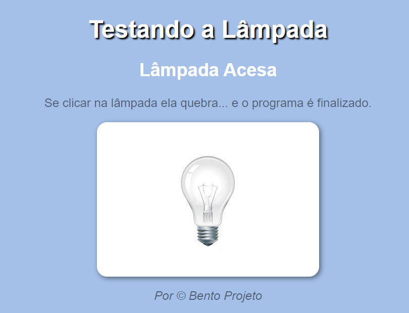
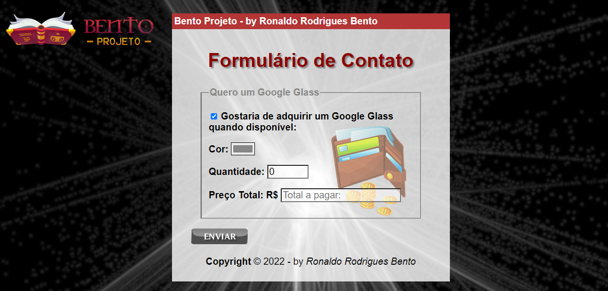

# aulas-de-javascript

## Exercírcios básicos em JavaScript

 

 ## IMPORTANTE ##
    Você tem todo o direito de usar esse material 
    para seu próprio aprendizado. Espero que seja útil 
    o conteúdo disponibilizado. 

## Exemplos de Scripts:

 

 

## Lista de exercícios de HTML-CSS e Java Script. 

O <strong>GitHub Pages</strong> é um serviço de hospedagem de site estático que usa arquivos HTML, CSS e JavaScript diretamente de um repositório no GitHub e, como opção, executa os arquivos por meio de um processo e publica um site.
 

<a href="https://ronaldobento.github.io/aulas-de-javascript/exercicios/ex01/index.html" target="_blank" rel="external" title="exercício 01"><strong>exercício 01</strong></a>

<a href="https://ronaldobento.github.io/aulas-de-javascript/exercicios/ex02/index.html" target="_blank" rel="external" title="exercício 02"><strong>exercício 02</strong></a>

<a href="https://ronaldobento.github.io/aulas-de-javascript/exercicios/ex03/index.html" target="_blank" rel="external" title="exercício 03"><strong>exercício 03</strong></a>

<a href="https://ronaldobento.github.io/aulas-de-javascript/exercicios/ex04/index.html" target="_blank" rel="external" title="exercício 04"><strong>exercício 04</strong></a>

<a href="https://ronaldobento.github.io/aulas-de-javascript/exercicios/ex05/index.html" target="_blank" rel="external" title="exercício 05"><strong>exercício 05</strong></a>

<a href="https://ronaldobento.github.io/aulas-de-javascript/exercicios/ex06/index.html" target="_blank" rel="external" title="exercício 06"><strong>exercício 06</strong></a>

<a href="https://ronaldobento.github.io/aulas-de-javascript/exercicios/ex07/index.html" target="_blank" rel="external" title="exercício 07"><strong>exercício 07</strong></a>

<a href="https://ronaldobento.github.io/aulas-de-javascript/exercicios/ex08/index.html" target="_blank" rel="external" title="exercício 08"><strong>exercício 08</strong></a>

<a href="https://ronaldobento.github.io/aulas-de-javascript/exercicios/ex09/index.html" target="_blank" rel="external" title="exercício 09"><strong>exercício 09</strong></a>

<a href="https://ronaldobento.github.io/aulas-de-javascript/exercicios/memory-game-rick-and-morty/index.html" target="_blank" rel="external" title="exercício 09"><strong>exercício extra</strong></a>

